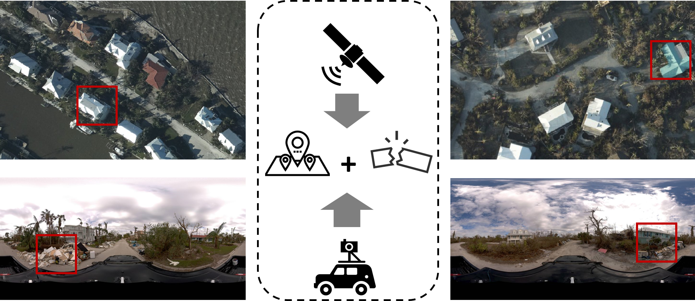
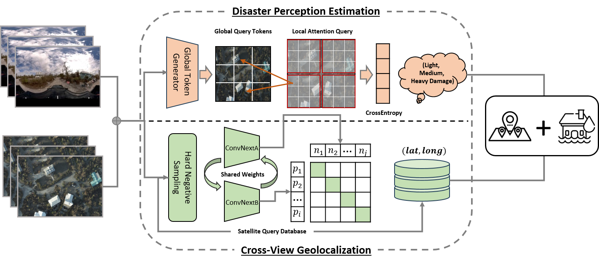
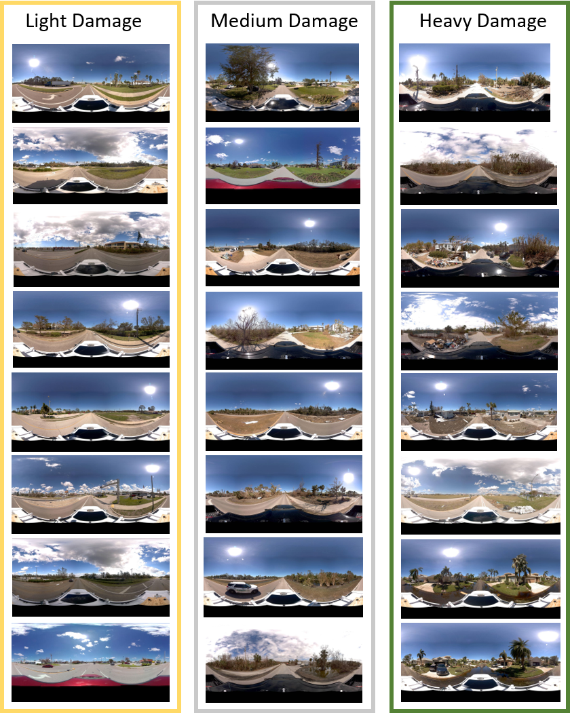

# CVDisaster
## Cross-View Geolocalization and Disaster Mapping with Street-View and VHR Satellite Imagery: A Case Study of Hurricane IAN
Authors: Li, Hao and Deuser, Fabian and Yin, Wenping and Luo, Xuanshu and Walther, Paul and Mai, Gengchen and Huang, Wei and Werner, Martin

<p align="center"> 
      
</p>

CVDisaster is a novel mapping framework that can addressing geolocalization and damage perception estimation using cross-view Street-View Imagery (SVI) and Very High-Resolution satellite imagery at the same time.

---
### Model architecture

<p align="center"> 
      
</p>

CVDisaster consists of two cross-view models:
  -  CVDisaster-Geoloc is a cross-view geolocalization model based on a contrastive learning objective with a Siamese ConvNeXt image encoder ([Sample4Geo](https://github.com/Skyy93/Sample4Geo) );
  -  CVDisaster-Est is a cross-view classification model based on a Couple Global Context Vision Transformer (based on [CGCViT](https://github.com/awsaf49/gcvit-tf)).
---
### Install and train

Before training, one need to download the CVIAN dataset from: [doi:10.14459/2024mp1749324](https://doi.org/10.14459/2024mp1749324)

#### For CVDisaster-Geoloc: 

1. Install the requirement.txt

```bash
pip install -r ./geolocalization/requirement.txt
```

2. Training the model:

    ```bash
    python ./geolocalization/0_train_cvdisaster.py
    ```
Herein, we use a pre-trained Sample4Geo Model please download the CVUSA weights from the [repository](https://github.com/Skyy93/Sample4Geo)


3. Evaluate the model

    ```bash
    python ./geolocalization/1_eval_cvdisaster.py
    ```
Again specify the split you want to evaluate, also change the checkpoint\_start parameter in the dataclass to the path of the trained weights.

#### For CVDisaster-Est: 

# Cross View Disaster

## Env

1. prepare docker container

    ```bash
    docker run -it --gpus device=1 --name gcvit --mount type=bind,source="$(pwd)",target=/root tensorflow/tensorflow:2.10.1-gpu
    ```

2. install `gcvit` inside the container

    ```bash
    python -m pip install --upgrade pip
    python -m pip install gcvit tensorflow_addons geojson rasterio scikit-learn --root-user-action=ignore  # anyway, we are in docker ;)
    ```

3. go to directory

    ```bash
    cd ~
    ```

## Steps
  - Run `0_prepare_satellite.py` to generate corresponding satellite images according to SVI locations (lonlat). Satellite tiles will be generated in `./data/01_Satellite/STL_ThreeCategories`
  - `1_svi.py` and `1_sat.py` will generate single-view results (`GCViTTiny`, 5/5 split).
  - `2_cv.py` will generate cross-view results (`GCViTTiny`). You can also change backbones of the model and specify training ratio using command-line options.

    ```bash
    python 2_cv.py --tr-ratio 0.5 --backbone tiny
    ```
  - `3_estimation.py` can create a text file where each line contains the estimation results, ground truth and corresponding images (ID).

---
### CVIAN dataset

CVIAN is a cross-view dataset to support geolocalization and disaster mapping with street-view and very high resolution (VHR) satellite imagery in Florida, USA after Hurricane IAN in 2022. The dataset is openly availble at [doi:10.14459/2024mp1749324](https://doi.org/10.14459/2024mp1749324).

CVIAN contains 1,135 pairs of street-view and VHR satellite imagery, which are manually classified into 3 classes (i.e., light, medium, and heavy damage). The VHR satellite imagery was originally provided by the National Oceanic and Atmospheric Administration (NOAA) at a spatial resolution of 30cm per pixel on September 30, 2022. The street-view imagery was collected from the open-source Mapilliary platform, speicifally from a mapping campaign done by Site Tour 360 after Hurricane IAN hit the study area. 

CVIAN is the first of this kind dataset that can support both cross-view geolocalization and disaster mapping at the same time.

#### Preview of CVIAN dataset:
<p align="center"> 
      
</p>


---
### Reference
If you find our work useful in your research please consider citing the CVDisaster paper.  
```
@article{li2024cvdisaster,
  title={Cross-View Geolocalization and Disaster Mapping with Street-View and VHR Satellite Imagery: A Case Study of Hurricane IAN},
  author={Li, Hao and Deuser, Fabian and Yin, Wenping and Luo, Xuanshu and Walther, Paul and Mai, Gengchen and Huang, Wei and Werner, Martin},
  journal={},
  volume={},
  number={},
  pages={},
  year={2024},
  publisher={}
}
```
Please go to [Dr. Hao Li's Homepage](https://bobleegogogo.github.io/) for more information.
